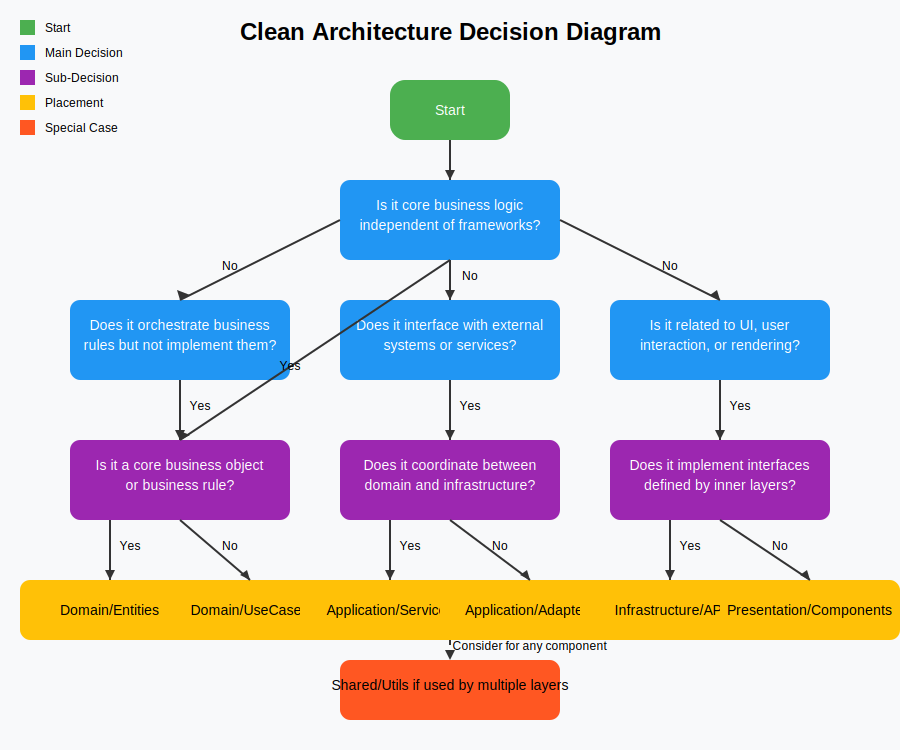

# Kicks 👟

A minimal template for building a scalable React application with RR7 and a bunch of other goodies.

[](https://codesandbox.io/s/github/mttwhlly/kicks)

[](https://stackblitz.com/github/mttwhlly/kicks)

## Features

- [React 19](https://reactjs.org/) for building user interfaces
- [Vite](https://vite.dev/) for fast development and builds
- [React Router 7](https://reactrouter.com/) for routing
- [TypeScript](https://www.typescriptlang.org/) for type safety
- [Material UI](https://mui.com) for UI components
- [Tanstack Query](https://tanstack.com/query/latest) for data fetching and state management
- [Tanstack Form](https://tanstack.com/form/latest) for form handling
- [Eslint](https://eslint.org/) and [Prettier](https://prettier.io/) for code quality and formatting
- [Tailwind CSS](https://tailwindcss.com/) for styling
- [Storybook](https://storybook.js.org/) for UI component development

## Getting Started

### Installation

Install the dependencies:

```bash
npm i
```

### Development

Start the development server with HMR:

```bash
npm run dev
```

Your application will be available at `http://localhost:5173`.

## Building for Production

Create a production build:

```bash
npm run build
```

## Running for Production

Run a production build:

```bash
npm run serve
```

## Deployment

### Docker Deployment

This template includes a `Dockerfile` for containerization.

To build and run using Docker:

```bash
# For npm
docker build -t kicks-app .

# Run the container
docker run -p 3000:3000 kicks-app
```

## Clean Architecture

Clean Architecture is a software design philosophy that emphasizes separation of concerns and independence of frameworks, UI, and databases. This template follows the principles of Clean Architecture to ensure a scalable and maintainable codebase.


